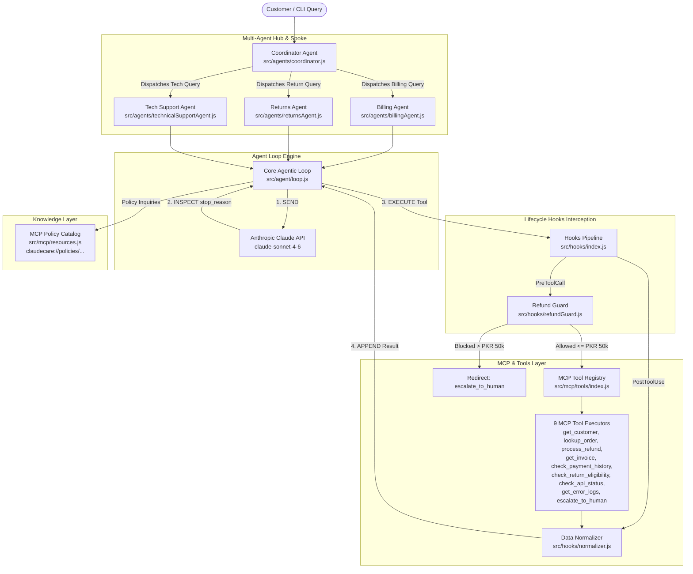

# 📖 ClaudeCare Project Architecture & `.claude` Best Practices Guide

> **Note:** This temporary guide summarizes the end-to-end architecture of ClaudeCare, how all system components are connected, and how the `.claude` folder utilizes universal practices compatible with Claude clients.

---

## 1. Executive Summary & Core Mission

**ClaudeCare** is an agentic AI customer support system built using the **Anthropic Claude API** (`claude-sonnet-4-6`). It autonomously resolves customer billing disputes, product returns, and technical support inquiries while enforcing hard business rules and escalating complex cases to human support agents when required.

### Core System Principles
- **Deterministic Loop Control**: Loop termination is governed *exclusively* by `response.stop_reason === 'end_turn'` (never by parsing text tokens).
- **Hub-and-Spoke Multi-Agent Architecture**: A single Coordinator agent triages queries and delegates tasks to domain-specialist agents without holding any business logic tools itself.
- **Deterministic Hooks > Probabilistic Prompts**: High-stakes business rules (such as refund limits > PKR 50,000) are enforced in hard code hooks (`PreToolCall`), not in prompt instructions.
- **Structured Tool Errors**: Tools never throw raw exceptions; they return structured error objects `{ isError, errorCategory, isRetryable, description }`.
- **4-Stage Build Discipline**: Spec $\rightarrow$ Predict output by hand $\rightarrow$ Run & verify $\rightarrow$ Commit to Git.
- **Currency Standard**: All monetary values are strictly formatted in **PKR** (Pakistani Rupees, e.g., `PKR 12,500.00`).

---

## 2. System Architecture & Connection Graph

### Connection Map



---

## 3. How Components Are Connected

| Component | Path | Responsibility | How It Connects to Other Parts |
| :--- | :--- | :--- | :--- |
| **Core Loop Engine** | `src/agent/loop.js` | Executes the 4-step loop (`SEND` $\rightarrow$ `INSPECT` $\rightarrow$ `EXECUTE` $\rightarrow$ `APPEND`). | Wraps all agent tool executions; inspects `stop_reason`; invokes the hook pipeline during tool calls. |
| **Coordinator Agent** | `src/agents/coordinator.js` | Receives raw queries, triages intent, packages context, and synthesizes final responses. | Holds **zero business tools**; spawns subagents (`billingAgent`, `returnsAgent`, `technicalSupportAgent`) sequentially or in parallel (`Promise.all`). |
| **Specialist Agents** | `src/agents/*.js` | Domain experts (Billing, Returns, Tech Support). | Scoped to 4–5 specialized tools each (prevents tool choice degradation); passes context to `loop.js`. |
| **Lifecycle Hooks** | `src/hooks/*.js` | Deterministic interception layer. | `PreToolCall` (`refundGuard.js`) intercepts calls *before* execution to block refunds > PKR 50,000. `PostToolUse` (`normalizer.js`) cleans up data (Unix timestamps $\rightarrow$ ISO 8601, status codes $\rightarrow$ strings) *after* execution. |
| **MCP Tool Registry** | `src/mcp/tools/index.js` | Central barrel registry of all 9 MCP tools. | Exports standard tool definitions and executor functions. Enforces structured 4-field errors. |
| **MCP Resources** | `src/mcp/resources.js` | Policy catalog for static rules (refund policy, return windows, SLAs). | Accessible via URI scheme (`claudecare://policies/...`); avoids wasting tool-call tokens for static policy lookups. |
| **MCP Config** | `.mcp.json` | Project-level MCP configuration. | Committed to Git; uses `${ENV_VAR}` expansion for API keys so entire teams share server setups securely. |
| **Specs & Predictions** | `specs_predict/*.md` | Test oracle & spec documentation for each feature day. | Guides manual prediction of tool execution output before code is run or committed. |

---

## 4. How `.claude/` Uses Practices Every Claude Client Can Use

The `.claude` folder in this codebase exemplifies modern configuration patterns designed for **Claude Code CLI**, **Claude AI Assistants**, **Claude Desktop**, and custom Anthropic API agents.

### Summary of `.claude` Architecture

```text
.claude/
├── CLAUDE.md                        ← (Symlinked/Imported Root Config)
├── commands/                        ← Project Slash Commands
│   ├── agent-status.md
│   ├── audit-errors.md
│   ├── check-hooks.md
│   ├── generate-test.md
│   └── review-tool.md
├── rules/                           ← Path-Scoped Development Rules
│   ├── hooks.md                     (paths: ["src/hooks/*.js"])
│   ├── mcp-tools.md                 (paths: ["src/mcp/tools/*.js", "src/mcp/tools/index.js"])
│   └── testing.md                   (paths: ["**/*.test.js", "**/test-*.js"])
├── skills/                          ← Self-Contained Forked Workflows
│   ├── analyze-coverage/SKILL.md    (context: fork, allowed-tools: [Read, Grep, Glob])
│   └── readonly-inspect/SKILL.md    (context: fork, allowed-tools: [Read, Grep])
└── standards/                       ← Shared Domain Standards
    ├── api-conventions.md           (Anthropic SDK usage, currency, message structure)
    └── tool-design.md               (5-component descriptions, error schemas)
```

---

### Universal Claude Client Practices Breakdown

#### 1. Pre-Loaded Context via `CLAUDE.md`
- **What it is:** `CLAUDE.md` at the project root is loaded into Claude's system context at session initialization.
- **Why it matters:** Rather than relying on human developers to remind Claude of rules on every prompt, `CLAUDE.md` acts as an invariant governance file for coding style, error schemas, and execution constraints.

#### 2. Modular Config Imports (`@import`)
- **What it is:** `CLAUDE.md` uses `@import .claude/standards/api-conventions.md` and `@import .claude/standards/tool-design.md`.
- **Why it matters:** Prevents `CLAUDE.md` from becoming a bloated, unmaintainable 500-line monolithic file. Claude clients automatically resolve `@import` statements to pull in targeted documentation seamlessly.

#### 3. Path-Scoped Rules (`.claude/rules/*.md` with `paths:` Frontmatter)
- **What it is:** Rules in `.claude/rules/` specify target file globs in YAML frontmatter, e.g.:
  ```yaml
  ---
  paths:
    - "src/hooks/*.js"
  ---
  ```
- **Why it matters:** Token efficiency and signal clarity. Instead of loading hook rules when editing tool schemas, the Claude client injects these rules **only when files matching the pattern are opened or modified**.

#### 4. Custom Slash Commands (`.claude/commands/*.md`)
- **What it is:** Lightweight, reproducible workflows defined as Markdown command guides:
  - `/agent-status`: Audits agent routing & tool distribution.
  - `/audit-errors`: Verifies structured error compliance across all 9 MCP tools.
  - `/check-hooks`: Ensures business logic is enforced by hooks rather than system prompts.
  - `/generate-test`: Generates test suites adhering to Stage 2 predictions and canonical IDs.
  - `/review-tool`: Rates tool descriptions against the 5-component standard.
- **Why it matters:** Any developer or Claude client can type `/command` in-session to run complex multi-file inspection and code generation routines deterministically.

#### 5. Skills with Sub-Agent Isolation & Tool Sandboxing (`.claude/skills/*/SKILL.md`)
- **What it is:** Advanced task definitions with explicit execution metadata:
  ```yaml
  ---
  context: fork
  allowed-tools:
    - Read
    - Grep
    - Glob
  argument-hint: "Which area? Enter: tools / agents / hooks / all"
  ---
  ```
- **Key Client Practices Used:**
  - **`context: fork` (Sub-agent Isolation):** Launches a separate, isolated sub-agent process to read codebase files and analyze coverage. Once complete, it discards intermediate tokens and returns *only* a concise summary to the main session. This eliminates **context bloat** and prevents the **"lost in the middle"** reasoning degradation.
  - **`allowed-tools` (Deterministic Sandboxing):** Hard-limits what tools the sub-agent can execute (`Read`, `Grep`, `Glob`). This guarantees read-only analysis and prevents destructive file modifications during inspection workflows.
  - **`argument-hint`:** Interactively prompts the user for required parameters before execution, preventing unguided full-codebase audits.

#### 6. Shared Architectural Standards (`.claude/standards/*.md`)
- **`api-conventions.md`**: Defines SDK constraints (e.g., model `claude-sonnet-4-6`), message content structure, and decimal arithmetic rules for PKR currency.
- **`tool-design.md`**: Mandates the **5-Component Tool Description Standard**:
  1. *Action:* What the tool does in one sentence.
  2. *Return Schema:* List of all fields and data types returned.
  3. *Positive Trigger:* Explicit trigger conditions.
  4. *Negative Boundary:* Explicit exclusions naming alternative tools.
  5. *Example Call:* Concrete input object format.

---

## 5. Tool Error Schema & Policy Standard

All MCP tools implement the following standard error object:

```json
{
  "isError": true,
  "errorCategory": "transient | validation | permission | business",
  "isRetryable": true | false,
  "description": "Human-readable explanation with contextual details."
}
```

### Error Category Breakdown

| Error Category | `isRetryable` | Trigger Example | Recommended Agent Action |
| :--- | :--- | :--- | :--- |
| **`transient`** | `true` | Network/DB timeout (`C-0000`) | Exponential backoff and retry. |
| **`validation`** | `true` | Malformed customer ID (`INVALID`) | Correct parameter format and retry. |
| **`permission`** | `false` | Unauthorized access attempt | Do not retry; escalate immediately. |
| **`business`** | `false` | Non-existent record (`C-9999`) or rule breach | Do not retry; explain business policy to user. |

---

## 6. Summary Checklist for Developers

When extending or maintaining **ClaudeCare**:
- [ ] **Creating a tool?** Ensure definition has all 5 components and executor returns 4-field error objects.
- [ ] **Adding a business rule?** Implement it as a `PreToolCall` or `PostToolUse` hook in `src/hooks/`, not just in system prompts.
- [ ] **Modifying agents?** Keep the Coordinator clean (0 business tools) and domain agents tightly scoped (4–5 tools max).
- [ ] **Writing tests?** Add a `// PREDICT: ...` comment before test assertions and use canonical IDs (`C-1001`, `INV-1001`, `ORD-5001`).
- [ ] **Running audits?** Use slash commands (`/audit-errors`, `/check-hooks`) or fork skills (`/analyze-coverage`).
